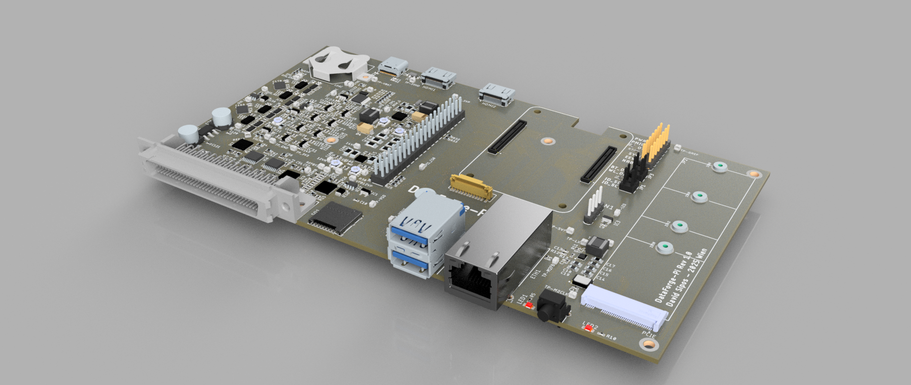
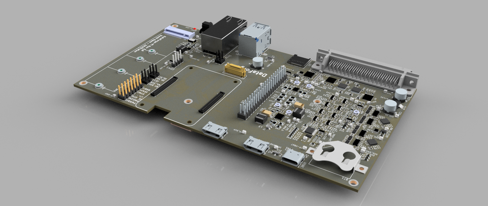
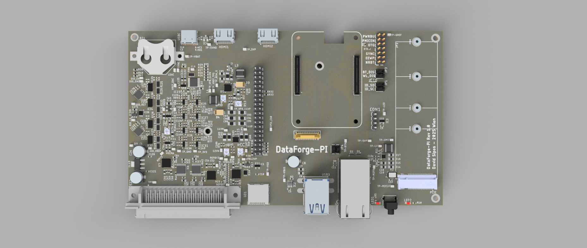

# DataForge-Pi Project

## Features

- Utilizes Raspberry Pi CM5 module
- Supports various analog and digital inputs/outputs
- Easy to set up and configure
- Open-source and customizable

## Getting Started

## Usage

Refer to the datasheets and manuals in the `docs` folder for detailed information on the components and usage instructions.

## License

This project is licensed under the GPL3 License. See the LICENSE file for details.

## Contact

For questions or feedback:

- Email: s.dvid@hotmail.com
- GitHub: [DvidMakesThings](https://github.com/DvidMakesThings)