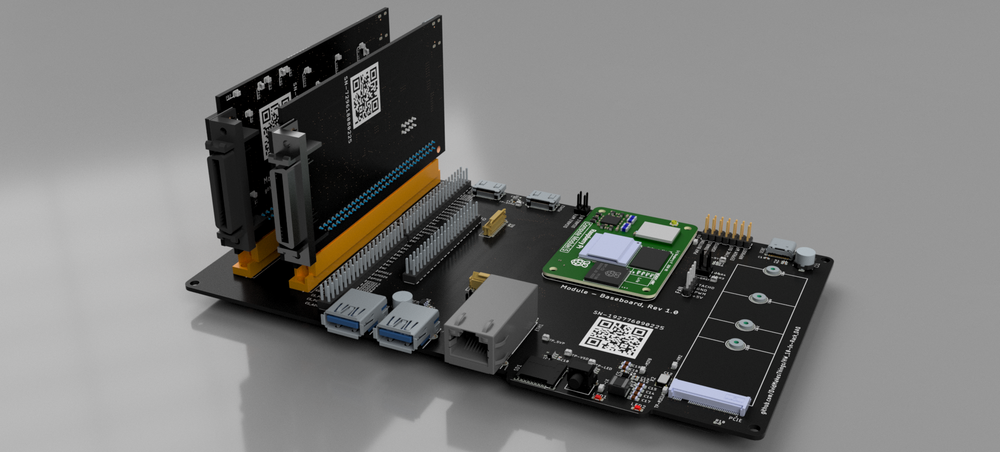

# DataForge-Pi - The Raspberry integrated DAQ Project

## Introduction

In the current market, finding a DAQ specifically designed for 10-inch racks is quite challenging. Most available options are tailored for 19-inch racks, which are significantly larger and not suitable for more compact setups. Recognizing this gap, I embarked on a project to create a DAQ solution that fits perfectly in a 10-inch rack while still providing all the necessary features and functionalities. The goal of this project is not only to address the size constraints but also to keep the costs low and make the design accessible to everyone. 

## Development Phases

| Phase                                | Status   |
| ------------------------------------ | -------- |
| **PCB Design & Prototyping**         |  |
| **Design Review**                    |  |
| **Enclosure Design**                 |  |
| **Order PCB**                        |  |
| **Prototyping and Hardware Testing** |  |
| **Initial Firmware Development**     |  |
| **Enclosure Testing & Ventilation**  |  |
| **Web-Based UI for Control**         |  |
| **Power Logging & Alerts**           |  |
| **Production Optimization**          |  |

## Features

Key features of the CM5 are as follows (for more details, refer to the [CM5 datasheet](docs/Datasheets/Raspberry-CM5_Datasheet.pdf)):

- Broadcom BCM2712, quad core Cortex-A76 (ARMv8) 64-bit SoC @ 2.4GHz
- Small Footprint 55mm × 40mm × 4.7mm module
  - 4 × M2.5 mounting holes
- 4kp60 HEVC decoder
- OpenGL ES 3.1 graphics, Vulkan 1.2
- Options for 2GB, 4GB, or 8GB LPDDR4-4267 SDRAM with ECC (see Appendix D)
- Options for 0GB (CM5Lite), 16GB, or 32GB eMMC flash memory (see Appendix D)
  - Peak eMMC bandwidth 400MBps (four times faster than previous Compute Modules)
- Option (see Appendix D) for certified radio module with:
  - 2.4 GHz, 5.0 GHz IEEE 802.11 b/g/n/ac wireless
  - Bluetooth 5.0, BLE
  - On board electronic switch to select between PCB trace or external antenna
- Gigabit Ethernet PHY supporting IEEE 1588
- 1 × PCIe 1-lane Host, Gen 2 (5Gbps)
- 1 × USB 2.0 port (high speed)
- 2 × USB 3.0 ports, supporting simultaneous 5Gbps operation
- Up to 30 × GPIO supporting either 1.8V or 3.3V signalling and peripheral options:
  - Up to 5 × UART
  - Up to 5 × I2C
  - Up to 5 × SPI
  - 1 × SDIO interface
  - 1 × DPI (parallel RGB display)
  - 1 × I2S
  - Up to 4 × PWM channels
  - Up to 3 × GPCLK outputs
- 2 × HDMI 2.0 ports (supports up to 4Kp60 on each port simultaneously)
- 2 × 4-lane MIPI ports
  - Supporting both DSI (display port) and CSI-2 (camera port)
- 1 × SDIO 2.0 (CM5Lite)
- Single +5V PSU input supports USB PD for up to 5A @ 5V
- Real-time clock (RTC), powered from external battery

## DAQ Specifications

### Analog Input (16 Channels)

The analog input section of the DAQ system is designed to provide high precision and flexibility for various applications. It features 16 channels of analog input, each capable of high-resolution data acquisition.

**Key Components:**
- **External 14-bit ADC:** The ADS9234RIRHBR is a 14-bit, 3.5-MSPS dual SAR ADC with simultaneous sampling, internal reference, and enhanced SPI, ensuring accurate and reliable measurements.
- **Multiplexers:** 2 × DG409 are employed for flexible channel selection, allowing the system to switch between different input channels efficiently.
- **Programmable Gain Amplifiers (PGA):** ADA4254ACPZ are used to provide scalable input ranges, enabling the system to handle a wide variety of signal amplitudes.

### Analog Output (8 Channels)

The analog output section is designed to provide precise and stable output signals. It features 8 channels of analog output, each capable of high-resolution signal generation.

**Key Components:**
- **External 16-bit DAC:** The DAC8568 is used for precision outputs, ensuring accurate and stable signal generation.
- **Operational Amplifiers:** TLV2372 are used for buffering and output stability, providing reliable and consistent performance.

### Digital IO (32 Channels)

The digital IO section is designed to provide versatile and robust digital input and output capabilities. It features 32 channels of digital IO, each capable of handling various voltage levels and signal types.

**Key Components:**
- **Bidirectional Voltage-Level Translators:** LSF0108-Q1 are used for multi-voltage compatibility, allowing the system to interface with different voltage levels.
- **Direct GPIO Support:** The RP2040 provides simple and robust design for direct GPIO support, ensuring reliable digital IO performance.

### Constants

- **ADC Sampling Rate:** 3.5 MSPS (Maximum sampling rate of ADS9234R)
- **ADC Nyquist Limit:** 1.75 MHz (Nyquist bandwidth for ADC)
- **PGA Bandwidth:** 10 MHz (Maximum bandwidth of ADA4254 at Gain = 1)
- **DG409 Transition Time:** 160 ns (Transition time for DG409)
- **ADA4254 Transition Time:** 200 ns (Transition time for ADA4254)

### Bandwidth for Each Gain Setting

The bandwidth for each gain setting is determined by the combination of the ADC's Nyquist limit and the PGA's frequency response. For gains less than or equal to 1, the bandwidth is capped by the ADC's Nyquist limit. For gains greater than 1, the bandwidth is limited by the PGA's frequency response.

- **Gain = 1/16:** Bandwidth = 1.75 MHz (Capped by ADC)
- **Gain = 1/8:** Bandwidth = 1.75 MHz (Capped by ADC)
- **Gain = 1/4:** Bandwidth = 1.75 MHz (Capped by ADC)
- **Gain = 1/2:** Bandwidth = 1.75 MHz (Capped by ADC)
- **Gain = 1:** Bandwidth = 1.75 MHz (Capped by ADC)
- **Gain = 2:** Bandwidth = 1.75 MHz (Capped by ADC)
- **Gain = 4:** Bandwidth = 1.75 MHz (Capped by ADC)
- **Gain = 8:** Bandwidth = 1.25 MHz (PGA Limited)
- **Gain = 16:** Bandwidth = 625 kHz (PGA Limited)
- **Gain = 32:** Bandwidth = 312.5 kHz (PGA Limited)
- **Gain = 64:** Bandwidth = 156.25 kHz (PGA Limited)
- **Gain = 128:** Bandwidth = 78.125 kHz (PGA Limited)

### Notes

- For Gains ≤ 1, bandwidth is capped by ADC's Nyquist limit (1.75 MHz).
- For Gains > 1, bandwidth is limited by the PGA's frequency response.
- Transition delays (DG409 + ADA4254) are factored into the calculation.

### Input Ranges for Different Gains

The input ranges for different gain settings are determined by the reference voltage (VREF), positive supply voltage (V+), and negative supply voltage (V-). For this system, VREF is set to 2.5V, V+ is set to +12V, and V- is set to -12V.

| Gain | Differential Input Range (±V) | Positive Input Range (0 to V) | Negative Input Range (0 to -V) | Max Bandwidth (Hz) |
|------|-------------------------------|-------------------------------|-------------------------------|--------------------|
| 1/16 | ±80.0                         | 0 to 40.0                     | 0 to -40.0                    | 1,750,000          |
| 1/8  | ±40.0                         | 0 to 20.0                     | 0 to -20.0                    | 1,750,000          |
| 1/4  | ±20.0                         | 0 to 10.0                     | 0 to -10.0                    | 1,750,000          |
| 1/2  | ±10.0                         | 0 to 5.0                      | 0 to -5.0                     | 1,750,000          |
| 1    | ±5.0                          | 0 to 2.5                      | 0 to -2.5                     | 1,750,000          |
| 2    | ±2.5                          | 0 to 1.25                     | 0 to -1.25                    | 1,750,000          |
| 4    | ±1.25                         | 0 to 0.625                    | 0 to -0.625                   | 1,750,000          |
| 8    | ±0.625                        | 0 to 0.3125                   | 0 to -0.3125                  | 1,250,000          |
| 16   | ±0.3125                       | 0 to 0.15625                  | 0 to -0.15625                 | 625,000            |
| 32   | ±0.15625                      | 0 to 0.078125                 | 0 to -0.078125                | 312,500            |
| 64   | ±0.078125                     | 0 to 0.0390625                | 0 to -0.0390625               | 156,250            |
| 128  | ±0.0390625                    | 0 to 0.01953125               | 0 to -0.01953125              | 78,125             |

## Getting Started

Refer to the datasheets and manuals in the `docs` folder for detailed information on the components and usage instructions.

## License

This project is licensed under the GPL3 License. See the LICENSE file for details.

## Contact

For questions or feedback:

- Email: s.dvid@hotmail.com
- GitHub: [DvidMakesThings](https://github.com/DvidMakesThings)